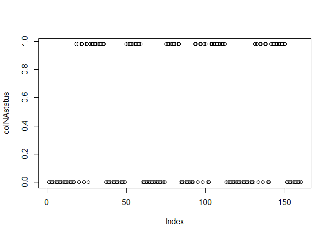
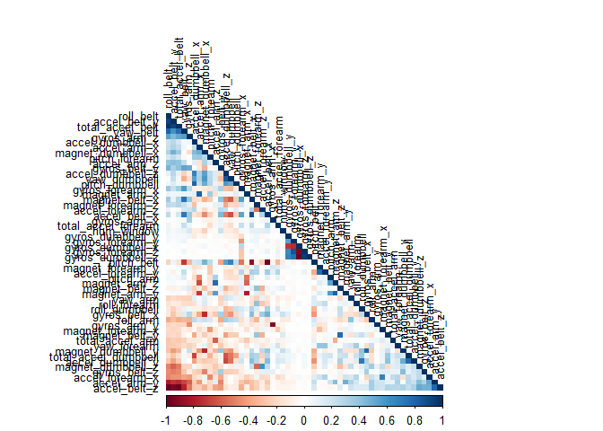

Practical Machine Learning
================
Rachit Kinger
5 September 2017

Summary
=======

Data from activity trackers was used to ascertain the quality of exercise. The activity data was broken into training data and validation data. Two models (random forest and linear discriminant analysis) were trained on the training data and validation data was used to determine which model had higher accuracy. Principle Component Analysis was performed on the data set to for computational ease, and also because quite a few variables were correlated.

Random Forest was the finally selected model because it had a 98% out-of-sample accuracy. The model was then applied on test data which had 20 observations, and it had a 100% accuracy on that.

Introduction
============

### About the data sets

The data for this project come from <http://groupware.les.inf.puc-rio.br/har>. Full source:

Velloso, E.; Bulling, A.; Gellersen, H.; Ugulino, W.; Fuks, H. “Qualitative Activity Recognition of Weight Lifting Exercises. Proceedings of 4th International Conference in Cooperation with SIGCHI (Augmented Human ’13)”. Stuttgart, Germany: ACM SIGCHI, 2013.

I'm grateful to the authors of the study for allowing their data to be used for further studies.

A short description of the datasets content from the authors’ website:
“Six young health participants were asked to perform one set of 10 repetitions of the Unilateral Dumbbell Biceps Curl in five different fashions: exactly according to the specification (Class A), throwing the elbows to the front (Class B), lifting the dumbbell only halfway (Class C), lowering the dumbbell only halfway (Class D) and throwing the hips to the front (Class E).

Class A corresponds to the specified execution of the exercise, while the other 4 classes correspond to common mistakes. Participants were supervised by an experienced weight lifter to make sure the execution complied to the manner they were supposed to simulate. The exercises were performed by six male participants aged between 20-28 years, with little weight lifting experience. We made sure that all participants could easily simulate the mistakes in a safe and controlled manner by using a relatively light dumbbell (1.25kg)."

Feature extraction
==================

We first load the data in the environment and separate it into training, validation and testing.

``` r
library(caret)
```

    ## Loading required package: lattice

    ## Loading required package: ggplot2

``` r
trainingURL <- "https://d396qusza40orc.cloudfront.net/predmachlearn/pml-training.csv"
testingURL <- "https://d396qusza40orc.cloudfront.net/predmachlearn/pml-testing.csv"
training_raw <- read.csv(url(trainingURL))
testing_raw <- read.csv(url(testingURL))
#split training into training and validation sets
set.seed(582)
inTrain <- createDataPartition(training_raw$classe, p = 0.8, list = FALSE)
training_unclean <- training_raw[inTrain,]
validation_unclean <- training_raw[-inTrain,]
```

Exploring and Preprocessing data
--------------------------------

To get the data ready for model building we explore the data and look for red flags like NA's, variables with near zero variance and multicollinearity.

#### Remove NAs

``` r
# remove NAs
colNAstatus <- sapply(training_unclean, function(x) mean(is.na(x)))
plot(colNAstatus) #visually inspect if variables contain large amount of NAs
```



From the above figure we can clearly see that there are many columns which contain a very large number of NA's and the remaining columns all contain almost `0` NAs. So we can remove columns that contain a large number of NAs.

``` r
#columns with >95% NAs will be removed
NAcols    <- colNAstatus > 0.95
training_noNAs <- training_unclean[,(NAcols == FALSE)]
validation_noNas <- validation_unclean[,(NAcols == FALSE)]
testing_noNAs <- testing_raw[,(NAcols == FALSE)]

#also remove the first 5 columns since they contain id variables  
training_noNAs <- training_noNAs[,-(1:5)]
validation_noNas <- validation_noNas[,-(1:5)]
testing_noNAs <- testing_noNAs[,-(1:5)]
```

#### Removing Variables with near zero variance

``` r
nzv <- nearZeroVar(training_noNAs, saveMetrics = TRUE) #identify nearZeroVar()
training <- training_noNAs[,row.names(nzv[nzv$nzv == FALSE,])] #training set now contains 54 vars including classe
validation <- validation_noNas[,row.names(nzv[nzv$nzv == FALSE,])] #validation set now contains 54 vars including classe
testing <- testing_noNAs[,c(row.names(nzv[nzv$nzv == FALSE,])[1:53],
                            colnames(testing_noNAs)[88])]  #testing contains the same set of variables as training except for the variable classe which is what we are trying to predict
```

#### Determining Multicollinearity

We still have 53 variables and want to check if we can further reduce variables that are highly correlated with each other.

``` r
library(corrplot)
cor_matrix <- cor(training[,-54]) #54th column is classe
corrplot(cor_matrix, order = "FPC", method = "color", type = "lower", 
         tl.cex = 0.8, tl.col = rgb(0,0,0))
```



Darker colours in the above figure tell us that there are many correlated variables and that we can probably benefit by running principal component analysis (PCA) as part of our preprocessing.

#### PCA for feature extraction

We run PCA with a threshold of 95%. This will also help in reducing computational load and a faster processing time.

``` r
prepca <- preProcess(training[,-54], method = "pca", thresh = 0.95)
trainingPCA <- predict(prepca, training)
validationPCA <- predict(prepca, validation)
testingPCA <- predict(prepca, testing)
dim(trainingPCA) # now reduced to 25 variables including classe variable
```

    ## [1] 15699    26

Model Building
==============

Two models were considered for this analysis:
1. Random Forest
2. Linear Discriminant Analysis

We will use cross validation with 3 folds.

``` r
#make clusters for parallel processing
library(iterators)
library(parallel)
library(foreach)
library(doParallel)
cluster <- makeCluster(detectCores())
doParallel::registerDoParallel(cluster)


# Random Forest model building  
set.seed(583)
mod2Control <- trainControl(method = "cv", number = 3, allowParallel = TRUE) #cross validation
mod_rf <- train(classe ~ ., data = trainingPCA, method = "rf", trControl=mod2Control)
```

    ## Loading required package: randomForest

    ## randomForest 4.6-12

    ## Type rfNews() to see new features/changes/bug fixes.

    ## 
    ## Attaching package: 'randomForest'

    ## The following object is masked from 'package:ggplot2':
    ## 
    ##     margin

``` r
# Linear Discriminant Analysis model building
set.seed(582)
mod1Control <- trainControl(method = "cv", number = 3, allowParallel = TRUE) #cross validation
mod_lda <- train(classe ~ ., data = trainingPCA, method = "lda", trControl=mod1Control)
```

    ## Loading required package: MASS

Model comparison on in-sample accuracy.

``` r
mod_rf
```

    ## Random Forest 
    ## 
    ## 15699 samples
    ##    25 predictor
    ##     5 classes: 'A', 'B', 'C', 'D', 'E' 
    ## 
    ## No pre-processing
    ## Resampling: Cross-Validated (3 fold) 
    ## Summary of sample sizes: 10467, 10465, 10466 
    ## Resampling results across tuning parameters:
    ## 
    ##   mtry  Accuracy   Kappa    
    ##    2    0.9684056  0.9600297
    ##   13    0.9657940  0.9567313
    ##   25    0.9610807  0.9507751
    ## 
    ## Accuracy was used to select the optimal model using  the largest value.
    ## The final value used for the model was mtry = 2.

``` r
mod_lda
```

    ## Linear Discriminant Analysis 
    ## 
    ## 15699 samples
    ##    25 predictor
    ##     5 classes: 'A', 'B', 'C', 'D', 'E' 
    ## 
    ## No pre-processing
    ## Resampling: Cross-Validated (3 fold) 
    ## Summary of sample sizes: 10467, 10466, 10465 
    ## Resampling results:
    ## 
    ##   Accuracy   Kappa    
    ##   0.5313094  0.4068731

Clearly the in-sample of the Random Forest (~96%) is vastly superior to that of LDA (53%). Because of this reason we will drop the LDA model at this point and proceed with Random Forest.

### Testing on validation set

``` r
pred_rf_validation <- predict(mod_rf, validationPCA)
confusionMatrix(pred_rf_validation, validationPCA$classe)
```

    ## Confusion Matrix and Statistics
    ## 
    ##           Reference
    ## Prediction    A    B    C    D    E
    ##          A 1106   15    1    0    0
    ##          B    1  737    4    0    0
    ##          C    6    7  673   19    4
    ##          D    2    0    6  622    3
    ##          E    1    0    0    2  714
    ## 
    ## Overall Statistics
    ##                                           
    ##                Accuracy : 0.9819          
    ##                  95% CI : (0.9772, 0.9858)
    ##     No Information Rate : 0.2845          
    ##     P-Value [Acc > NIR] : < 2.2e-16       
    ##                                           
    ##                   Kappa : 0.9771          
    ##  Mcnemar's Test P-Value : NA              
    ## 
    ## Statistics by Class:
    ## 
    ##                      Class: A Class: B Class: C Class: D Class: E
    ## Sensitivity            0.9910   0.9710   0.9839   0.9673   0.9903
    ## Specificity            0.9943   0.9984   0.9889   0.9966   0.9991
    ## Pos Pred Value         0.9857   0.9933   0.9492   0.9826   0.9958
    ## Neg Pred Value         0.9964   0.9931   0.9966   0.9936   0.9978
    ## Prevalence             0.2845   0.1935   0.1744   0.1639   0.1838
    ## Detection Rate         0.2819   0.1879   0.1716   0.1586   0.1820
    ## Detection Prevalence   0.2860   0.1891   0.1807   0.1614   0.1828
    ## Balanced Accuracy      0.9927   0.9847   0.9864   0.9820   0.9947

The Random Forest model has a **98% accuracy** on the validation set with a **sensitivity of &gt;96%** for each prediction class, which, surprisingly is even better than it's in-sample accuracy.

We will now use this model on the testing set.

``` r
pred_rf_test <- predict(mod_rf, testingPCA)
```

Below are the results which have been checked against the results provided by Coursera and surprisingly, the accuracy on testing data is 100%.

``` r
data.frame(problem_id = testingPCA[,1], classe = pred_rf_test)
```

    ##    problem_id classe
    ## 1           1      B
    ## 2           2      A
    ## 3           3      B
    ## 4           4      A
    ## 5           5      A
    ## 6           6      E
    ## 7           7      D
    ## 8           8      B
    ## 9           9      A
    ## 10         10      A
    ## 11         11      B
    ## 12         12      C
    ## 13         13      B
    ## 14         14      A
    ## 15         15      E
    ## 16         16      E
    ## 17         17      A
    ## 18         18      B
    ## 19         19      B
    ## 20         20      B

**END OF REPORT**
